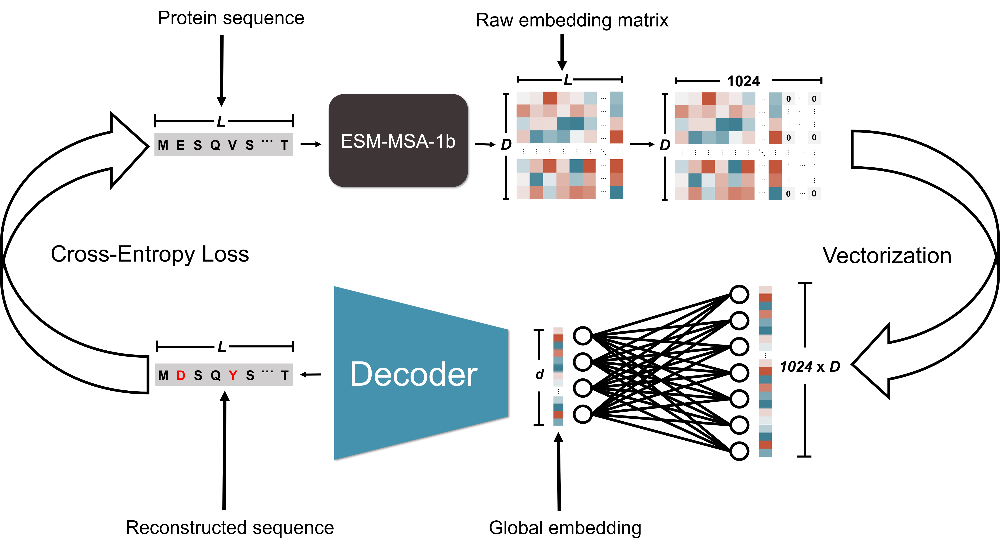
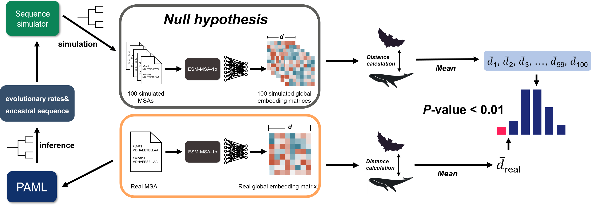

# ACEP (Adaptive Convergence by Embedding of Protein)
***

ACEP (Adaptive Convergence by Embedding of Protein) detects convergent signal among homologous protein sequences based on embeddings output by ESM-MSA-1b. 
***
## Whole process of convergence detection

***
## Content
- **Process of convergent signal detection**
  - Preprocess of raw protein sequences and codon sequences
  - Inference of evolutionary parameters and ancestral sequence reconstruction by PAML
  - Simulation of null sequences under neutral circumstance
  - Protein sequences embedding calculation based on ESM-MSA-1b and bottleneck
  - Statistical test of convergence by distances comparison

***
## Usage
## Evironment deployment
The name of conda environment is ACEP.
```shell
conda env create -f environment.yml
conda activate ACEP
```
## Quick start
The meaning of every paramter used here will be explained in ***Step by Step*** part. Users can specify the absolute path of this project's directory by ***abspath*** parameter.
<br>

You should specify the relative path of raw protein sequences and raw CDS sequences by ***rawAAdir*** and ***rawCDSdir***. Furthermore, ***dataset_location*** represents save place of cleaned protein sequences and the working directory of following procedure.
```shell
python ./ConvDet_main.py \
      --abspath abspath \
      --dataset_location ./Test_data/Test_data_output/clean \
      --rawAAdir ./Test_data/Test_data_input/raw/aa_genes \
      --rawCDSdir ./Test_data/Test_data_input/raw/nt_genes \
      --codeml_str ./PhyloInfer/01_data/codemlstr.txt \
      --tree_file ./PhyloInfer/01_data/abs_mammal.nwk \
      --dat_file ./PhyloInfer/01_data/wag.dat \
      --combine_dir ./Test_data/Test_data_output/CombineFiles \
      --freq_mode gene \
      --model_location ./Embeddings/03_model/esm_msa1b_t12_100M_UR50S.pt \
      --repr_layers 12 \
      --bottleneck_weight ./Embeddings/03_model/linear1_weight.pt \
      --include bottleneck \
      --device cuda:0 \
      --case_sps1 Physeter_catodon Lipotes_vexillifer Delphinapterus_leucas Orcinus_orca Tursiops_truncatus \
      --case_sps2 Miniopterus_natalensis Myotis_davidii Myotis_brandtii Myotis_lucifugus Eptesicus_fuscus Hipposideros_armiger Rhinolophus_sinicus Rousettus_aegyptiacus \
      --embed_single True \
      --simtime 100
```
Otherwise you can only run the *ACEP/ConvDet.sh* to simply obtain results.
```shell
bash ConvDet.sh
```

## Step by step
### Preprocess of raw protein sequences and codon sequences
***dataset_location*** is directory for saving the MSA after eliminating gap columns and inferior sequences, ***rawAAdir*** and ***rawCDSdir*** are directories contain raw protein and codon sequences which downloaded from OrthoMam in our case. ***case_sps1*** and ***case_sps2*** are two focus species groups we intend to detect convergent signal as bash script shows separated by space. Script is from *ACEP/01_Preprocess/genome_clean.sh*.
<br><br>
Output will be multiple directories named by id of genes each contains a fasta file with suffix ***aa.cleaned.fasta*** or ***cds.cleaned.fasta***.
```shell
python ./01_SeqClean.py \
	  --dataset_location ../02_output/01_AA_data \
	  --rawAAdir ../01_data/aa_genes \
	  --rawCDSdir ../01_data/nt_genes \
	  --case_sps1 Physeter_catodon Lipotes_vexillifer Delphinapterus_leucas Orcinus_orca Tursiops_truncatus \
	  --case_sps2 Miniopterus_natalensis Myotis_davidii Myotis_brandtii Myotis_lucifugus Eptesicus_fuscus Hipposideros_armiger Rhinolophus_sinicus Rousettus_aegyptiacus
```
### Inference of evolutionary parameters and ancestral sequence reconstruction by PAML
Evolutionary rates and ancestral sequences are crucial parameters for simulating null sequences which represent the case that protein sequences evolve under neutral circumstances.
<br>
In this script, the ***dataset_location*** is the output directory of last step containing cleaned protein sequences, ***codeml_str*** is the PAML control file template. Here we choose the ***wag.dat*** as substitution file for inference, otherwise can specify customized substitution model's path. ***tree_file*** represents path of phylogenetic tree topology file containing string of nwk format without branch length.
<br><br>
Output will be directory with suffix ***pamlparas*** containing control file, partial tree file and specified control file in each gene's corresponding directory. 
```shell
python ./01_pamlparas.py \
          --dataset_location ../02_output/01_AA_data \
          --codeml_str ../01_data/codemlstr.txt \
          --dat_file ../01_data/wag.dat \
          --tree_file ../01_data/abs_mammal.nwk
```
After directories with suffix ***pamlparas*** were created, following script will help to infer the parameters of each gene more quickly. The location of *1* specify the number of processes and the second parameter represents the directory where analysed genes located.
<br><br>
We will obtain constructed ancestral sequence and tree topology with inferred branch lengths in ***rst*** file. In addition, every site's evolutionary rate is deposited in ***rates*** file. These parameters will be transferred for simulating null sequences in next step.
```shell
bash ./02_pamlinfer.sh 1 ../02_output/01_AA_data
```

### Simulation of null sequences under neutral circumstance
The script of this step will simulate null protein sequences from constructed ancestral protein sequence in root node under neutral circumstance along the fixed tree topology with inferred branch length by PAML in former step.
***dataset_location*** represents the directory containing each gene's directory with PAML inferred results in directory ending with ***pamlparas*** and cleaned fasta file with suffix ***aa.cleaned.fasta***.
<br><br>
There will be two new directories within each gene's directory after simulation process. One of them ending with ***inferred_tree*** which contains tree nwk file with inferred branch lengths and another contains 100 simulated MSAs with suffix ***SimSequences***. The files within Simulated sequence directories will be the pattern ***Seqid_SimulatedIndex.aa.cleaned.fasta***.
```shell
python ./Simulation.py \
          --dataset_location ../02_output/01_AA_data \
          --codeml_str ../01_data/codemlstr.txt \
          --freq_mode gene \       # gene or site model can be choosed
          --dat_file ../01_data/wag.dat \
          --tree_file ../01_data/abs_mammal.nwk \
          --simtime 100 \         # default value is 100
          --seqid $seqid           # such as ENSG00000000003_0
```
Furthermore, this prepared multiple processes script will speed up simulation process of genes in ***dataset_location***. Same meaning of parameters as former inference step.
```shell
bash ./Simulation.sh 1 ../02_output/01_AA_data
```

### Protein sequences embedding calculation based on ESM-MSA-1b and bottleneck
The script of this step intends to calculate the embeddings of protein sequences based on ESM-MSA-1b and ***bottleneck*** full linear layer with parameters we obtain after training. ***combine_dir*** represents the directory contain each gene's combined fasta file with original and simulated protein sequences. ***model_location*** and ***bottleneck_weight*** specify the path of ESM-MSA-1b and ***bottleneck*** structures' parameters files. Use ***include*** to specify the kind of output embedding, ***raw***, ***mean*** and ***bottleneck*** can be choosed. ***embed_single*** with True will only calculate protein sequences of ***case_sps1*** and ***case_sps2***'s embeddings.
<br><br>
Ouput directory will contain combined sequences file in Combinedir, and there will be two new directories in each gene's directory. One with suffix ***alter_Embedding*** save the original protein sequences' embeddings, another with suffix ***null_Embedding*** contains all simulated sequences' corresponding embeddings if ***embed_single*** were specified as False.
```shell
python ./Embedding.py \
      --dataset_location ../02_output/01_AA_data \
      --combine_dir ../02_output/Combinedir \
      --model_location ../04_model/esm_msa1b_t12_100M_UR50S.pt \
      --repr_layers 12 \
      --bottleneck_weight ../04_model/linear1_weight.pt \
      --include bottleneck \
      --case_sps1 Physeter_catodon Lipotes_vexillifer Delphinapterus_leucas Orcinus_orca Tursiops_truncatus \
      --case_sps2 Miniopterus_natalensis Myotis_davidii Myotis_brandtii Myotis_lucifugus Eptesicus_fuscus Hipposideros_armiger Rhinolophus_sinicus Rousettus_aegyptiacus \
      --embed_single True \
      --device cuda:0

```
### Statistical test of convergence by distances comparison
This script will calculate the distribution of distances of two focus species groups pair by pair using simulated MSAs and real MSA. The meaning and contents of all parameters used here are same as former steps.
<br><br>
Finally, there will be five new files in each gene's corresponding directory with suffix ***distribution.pickle*** or ***distribution.npy***. ***distribution.npy*** files contain each MSA's four kinds of distance pair by pair with the shape ***(number of simualted or real MSAs, number of case_sps1 x number of  case_sps2, 4)***. ***distribution.pickle*** file also contain pair distances but with a list json form. The file with suffix ***convresult.pickle*** contains empirical *P* values of four kinds of distances with list form.
```shell
python ./ConvStatistic.py \
        --dataset_location ../02_output/01_AA_data \
        --case_sps1 Physeter_catodon Lipotes_vexillifer Delphinapterus_leucas Orcinus_orca Tursiops_truncatus \
        --case_sps2 Miniopterus_natalensis Myotis_davidii Myotis_brandtii Myotis_lucifugus Eptesicus_fuscus Hipposideros_armiger Rhinolophus_sinicus Rousettus_aegyptiacus \
        --include bottleneck \
        --simtime 100 \
        --embed_single True \
        --repr_layers 12
```
